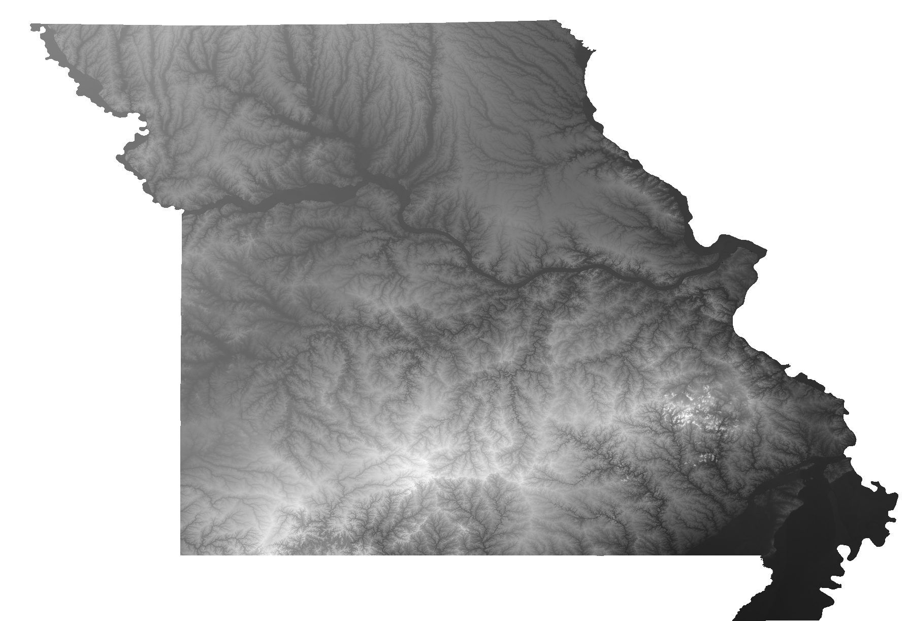
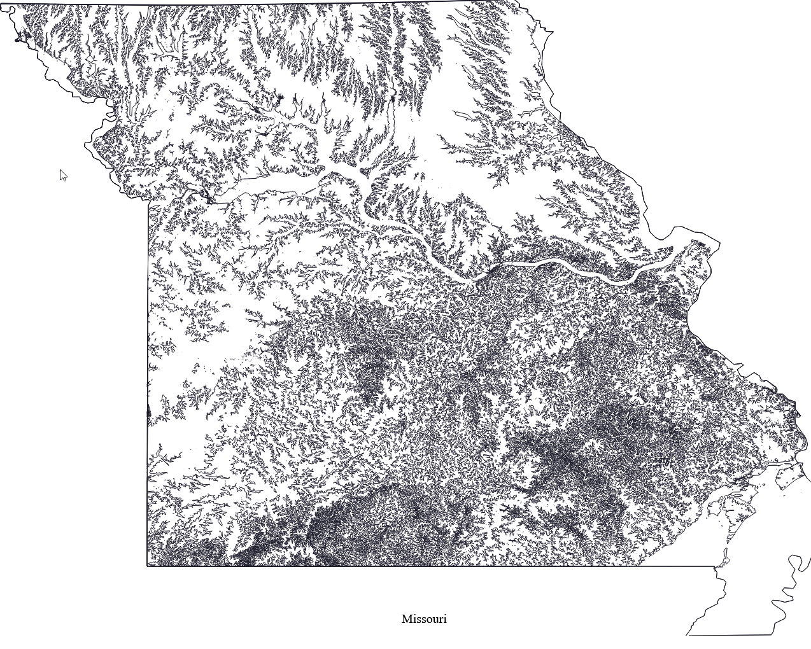

# plot-elevation
A script to generate a plottable svg of any US state's elevation contours.  Uses the `elevation` library to query open data from the [SRTM 30m Global 1 arc second V003](https://lpdaac.usgs.gov/products/srtmgl1nv003/) dataset from NASA and NGA, and the [SRTM 90m Digital Elevation Database v4.1](https://bigdata.cgiar.org/srtm-90m-digital-elevation-database/) from CGIAR-CSI.  No API keys required, just provide a state name and the data is returned :\)

## Dependencies
These are required pip packages:
- `osmnx`
- `rasterio`
- `gdal`
- `matplotlib`
- `elevation`
- `geopandas`
- `svgwrite`
- `shapely`

## Usage
1. Install dependencies via `pip`
2. `python state_boundaries.py <state_name>` where `state_name` is a US state.

## Outputs
Currently this script generates:
1. A `.shp` shapefile, and its corresponding `.cpg`, `.dbf`, `.prj`, `.shx` files
2. An SVG of the shapefile's outline - useful as a single-line layer for the state's outline, separate from the contour data
   
3. A merged GeoTIFF clipped to the state's shapefile.  You can import this into QGIS to visualize the state's elevation changes.
   
4. An SVG containing the state's elevation data sampled at 10 levels across the elevation range
   

## TODO
1. Add a nice border to the final SVG
2. Add some text to the final SVG.  State name, elevation stats (min, max, avg), area, population, etc.
