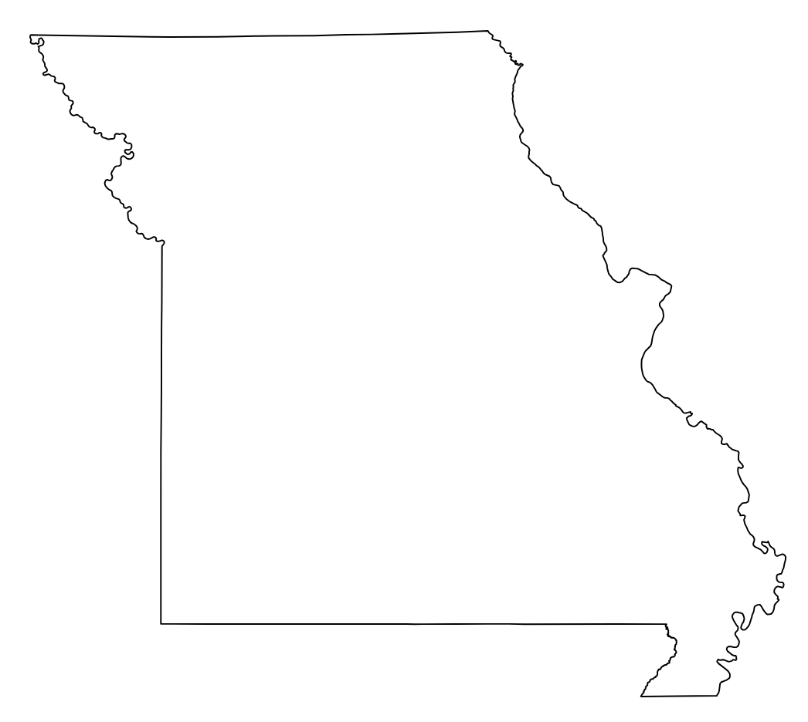

# plot-elevation
A script to generate a plottable svg of any US state's elevation contours.  Uses the `elevation` library to query open data from the [SRTM 30m Global 1 arc second V003](https://lpdaac.usgs.gov/products/srtmgl1nv003/) dataset from NASA and NGA, and the [SRTM 90m Digital Elevation Database v4.1](https://bigdata.cgiar.org/srtm-90m-digital-elevation-database/) from CGIAR-CSI.  No API keys required, just provide a state name and the data is returned :\)

## Dependencies
These are required pip packages:
- `osmnx`
- `rasterio`
- `gdal`
- `matplotlib`
- `elevation`
- `geopandas`
- `svgwrite`
- `shapely`

## Usage
1. Install dependencies via `pip`
2. `python state_boundaries.py <state_name>` where `state_name` is a US state.

## Outputs
Currently this script generates three outputs:
1. A `.shp` shapefile, and its corresponding `.cpg`, `.dbf`, `.prj`, `.shx` files
2. An SVG of the shapefile's outline - useful as a single-line layer for the state's outline, separate from the contour data
   
3. A merged GeoTIFF clipped to the state's shapefile.  You can import this into QGIS to visualize the state's elevation changes.
   

## TODO
1. Generate SVG paths from elevation data
2. Generate a merged outline + elevation SVG
   1. Right now it seems the elevation data is wider than the outline SVG, but the shapefile was used to generate both :thinking:
3. Add a nice border to the final SVG
4. Add some text to the final SVG.  State name, elevation stats (min, max, avg), area, population, etc.
